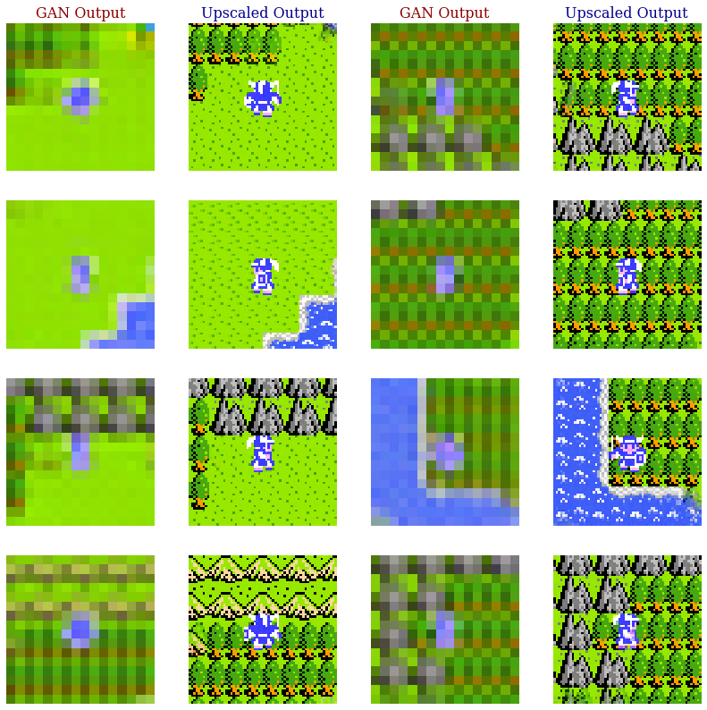
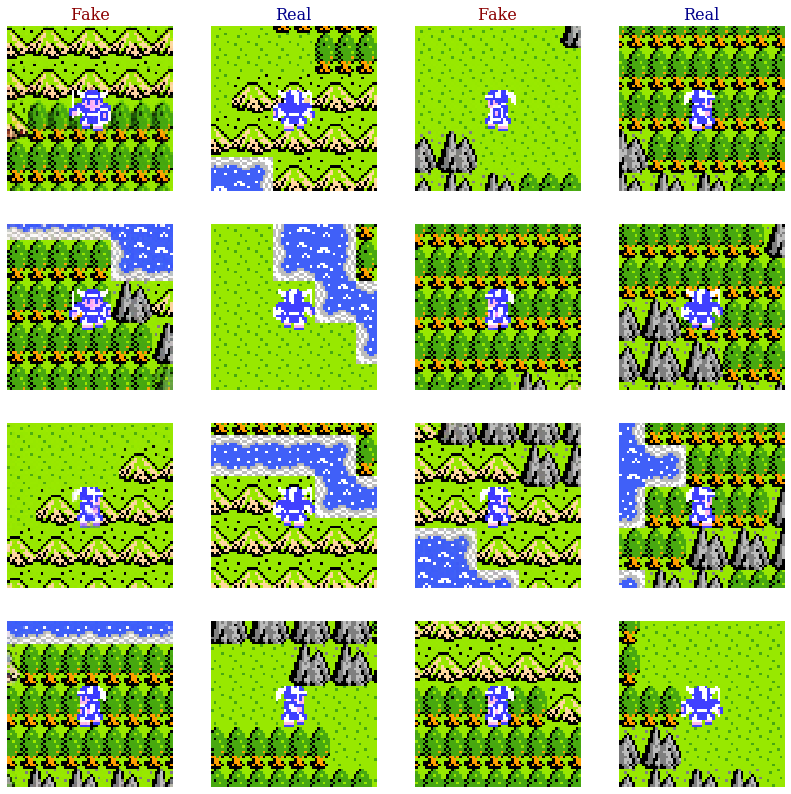

# Dragon-Warrior-WGAN
Dragon Warrior is a video game released on the Nintendo Entertainment System (NES) in 1989. Most of the gameplay involves exploring the world map. The problem considered here is approximating the distribution of the images which the player sees during this exploration, using a generative adversarial network (GAN). The dataset used consists of about 68,000 images pulled from gameplay footage which I recorded as I played the game. Here is an example of gameplay:

NES images have dimensions 256x240, but I was training models on my laptop, so to make the problem more tractible, I cropped the images to 64x64:

This distribution of images is interesting because it consists of a relatively small number of very distinct assests that may occur in many different configurations (contrast this with images of faces, for example). The problem is also interesting because the images need to be nearly pixel-perfect for them to look like real images of an NES game. 

After experimenting with a "vanilla" GAN, I changed the algorithm to a Wasserstein GAN (WGAN), following the paper "Wasserstein GAN" by Arjovsky, Chintala, and Bottou. After this, performance was still unsatisfactory, so I upraged to a WGAN with gradient penalty, following the paper "Improved Training of Wasserstein GANs" by Gulrajani, Ahmed, Arjovsky, Dumoulin, and Courville. The code is written with python, using TensorFlow and Keras. The code and images given here are from two versions of the model, which I will call the "end-to-end scheme" and the "upscaler scheme".

End-to-End Scheme:

In this scheme I trained a network to generate 64x64 images directly from the latent space. The generator and discriminator networks were trained for 185 epochs (each epoch took about 26 minutes running on my laptop's gpu, NVIDIA GeForce GTX 1060), manually decreasing the learning rate by factors of about 1/2 (starting at 1e-4 and ending at 1e-7). Although the original WGAN paper recommends a large value of the hyperparameter n_critic (the ratio of number of updates of discriminator to number of updates to generator), specifically n_critic = 5, I found that such large values lead to strange effects in the images (e.g., large splotches of color). During my training, n_critic = 2 seemed to be the optimal value. 

The code for this scheme is contained in Dragon_Warrior_WGAN.py. The generator and discriminator are stored in gen_model.h5 and disc_model.h5. See the folder "generated_images" for some fake images generated with this scheme. Example:

The folder "images_generated_along_axes" contains some collections of images showing how the output of the generator varies as we move along the first two dimensions of the latent space.

Upscaler Scheme

In this scheme I trained an upscaler to recover gameplay images which have first been downscaled from 64x64 to 16x16, and then have had some Gaussian noise added. The code is contained in Dragon_Warrior_upscaler.py. The model was trained for 62 epochs. Here are some example outputs:

I then trained a WGAN to produce 16x16 images which look like the downscaled gameplay images. The code is contained in Dragon_Warrior_WGAN_low_res.py. The generator/discriminator were trained for 33 epochs. Here is an example out the GAN outputs, before and after being fed through the upscaler:

Here is a side-by-side comparison of some real and fake images:

Finally, here are some images showing how the generated output varies as we move along two dimensions in the latent space:

While the outputs of the upscaler scheme are not completely perfect, many outputs are indistinguishable from real images, and there is a significant improvement over the end-to-end scheme. 
